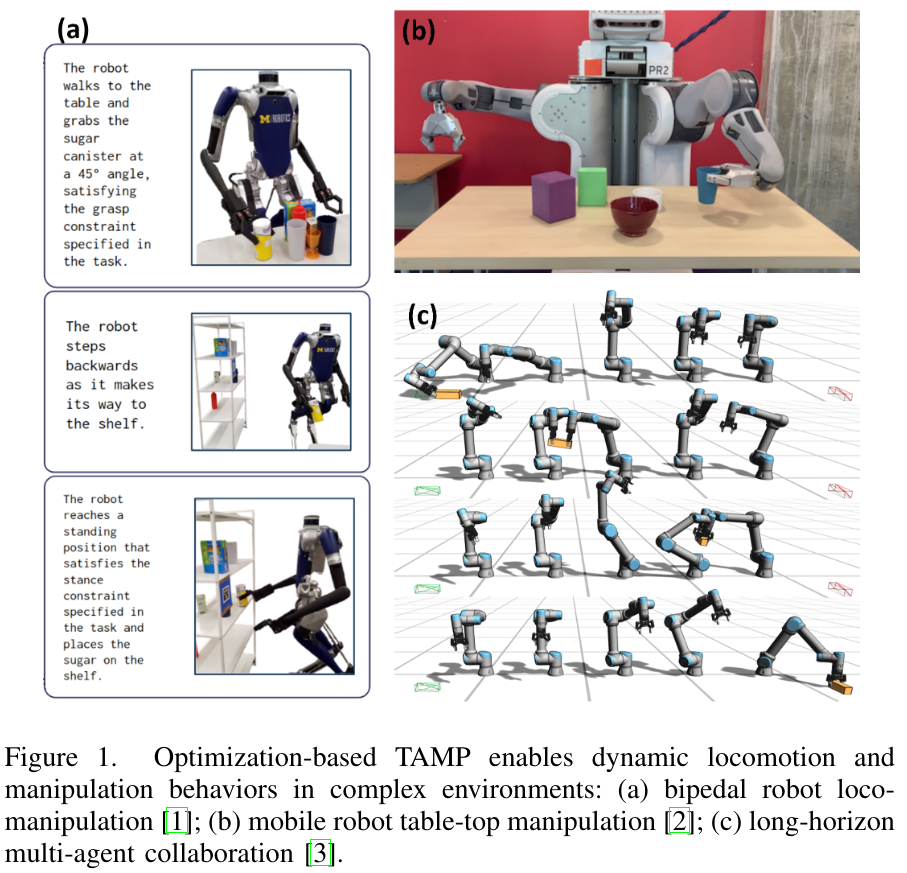
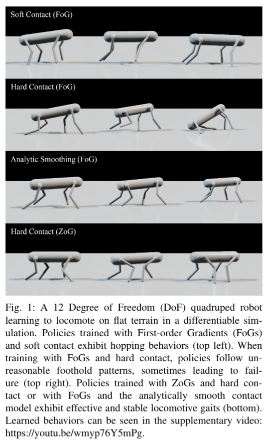

## 2024-04-04

### SliceIt! -- A Dual Simulator Framework for Learning Robot Food Slicing

- **Authors**: Cristian C. Beltran-Hernandez, Nicolas Erbetti, Masashi Hamaya
- **Main Affiliations**: OMRON SINIC X Corporation
- **Tags**: `Simulation to Reality`

#### Abstract

Cooking robots can enhance the home experience by reducing the burden of daily chores. However, these robots must perform their tasks dexterously and safely in shared human environments, especially when handling dangerous tools such as kitchen knives. This study focuses on enabling a robot to autonomously and safely learn food-cutting tasks. More specifically, our goal is to enable a collaborative robot or industrial robot arm to perform food-slicing tasks by adapting to varying material properties using compliance control. Our approach involves using Reinforcement Learning (RL) to train a robot to compliantly manipulate a knife, by reducing the contact forces exerted by the food items and by the cutting board. However, training the robot in the real world can be inefficient, and dangerous, and result in a lot of food waste. Therefore, we proposed SliceIt!, a framework for safely and efficiently learning robot food-slicing tasks in simulation. Following a real2sim2real approach, our framework consists of collecting a few real food slicing data, calibrating our dual simulation environment (a high-fidelity cutting simulator and a robotic simulator), learning compliant control policies on the calibrated simulation environment, and finally, deploying the policies on the real robot.

[Paper Link](https://arxiv.org/abs/2404.02569)

  

    
    
SAPIEN

  

### A Survey of Optimization-based Task and Motion Planning: From Classical To Learning Approaches

- **Authors**: Zhigen Zhao, Shuo Chen, Yan Ding, Ziyi Zhou, Shiqi Zhang, Danfei Xu, Ye Zhao
- **Main Affiliations**: Georgia Institute of Technology
- **Tags**: `Survey`, `TAMP`

#### Abstract

Task and Motion Planning (TAMP) integrates high-level task planning and low-level motion planning to equip robots with the autonomy to effectively reason over long-horizon, dynamic tasks. Optimization-based TAMP focuses on hybrid optimization approaches that define goal conditions via objective functions and are capable of handling open-ended goals, robotic dynamics, and physical interaction between the robot and the environment. Therefore, optimization-based TAMP is particularly suited to solve highly complex, contact-rich locomotion and manipulation problems. This survey provides a comprehensive review on optimization-based TAMP, covering (i) planning domain representations, including action description languages and temporal logic, (ii) individual solution strategies for components of TAMP, including AI planning and trajectory optimization (TO), and (iii) the dynamic interplay between logic-based task planning and model-based TO. A particular focus of this survey is to highlight the algorithm structures to efficiently solve TAMP, especially hierarchical and distributed approaches. Additionally, the survey emphasizes the synergy between the classical methods and contemporary learning-based innovations such as large language models. Furthermore, the future research directions for TAMP is discussed in this survey, highlighting both algorithmic and application-specific challenges.

[Paper Link](https://arxiv.org/abs/2404.02817)

### Learning Quadrupedal Locomotion via Differentiable Simulation

- **Authors**: Clemens Schwarke, Victor Klemm, Jesus Tordesillas, Jean-Pierre Sleiman, Marco Hutter
- **Main Affiliations**: Robotic Systems Lab-ETH Zurich
- **Tags**: `Simulation`

#### Abstract

The emergence of differentiable simulators enabling analytic gradient computation has motivated a new wave of learning algorithms that hold the potential to significantly increase sample efficiency over traditional Reinforcement Learning (RL) methods. While recent research has demonstrated performance gains in scenarios with comparatively smooth dynamics and, thus, smooth optimization landscapes, research on leveraging differentiable simulators for contact-rich scenarios, such as legged locomotion, is scarce. This may be attributed to the discontinuous nature of contact, which introduces several challenges to optimizing with analytic gradients. The purpose of this paper is to determine if analytic gradients can be beneficial even in the face of contact. Our investigation focuses on the effects of different soft and hard contact models on the learning process, examining optimization challenges through the lens of contact simulation. We demonstrate the viability of employing analytic gradients to learn physically plausible locomotion skills with a quadrupedal robot using Short-Horizon Actor-Critic (SHAC), a learning algorithm leveraging analytic gradients, and draw a comparison to a state-of-the-art RL algorithm, Proximal Policy Optimization (PPO), to understand the benefits of analytic gradients.

[Paper Link](https://arxiv.org/abs/2404.02887)

